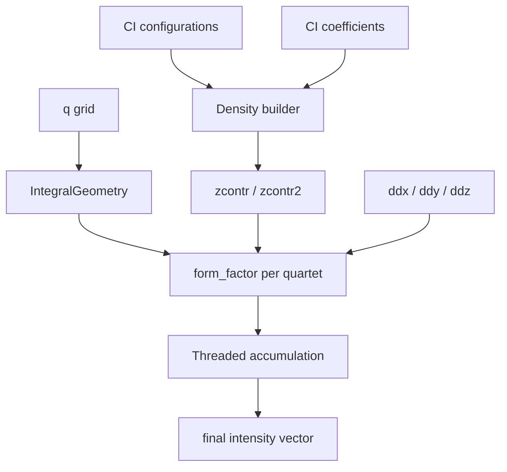

# Scattering workflow

This page summarizes the new Julia translation of the Fortran
`total_scattering_calculation` routine. The goal is to make the inputs and
intermediate arrays explicit so callers can mix data from Fortran drivers with
Julia kernels without relying on COMMON blocks.

## Inputs and outputs

- `type` — `1` for total scattering, `2` for elastic scattering. Other values
  throw an error.
- `q` — one-dimensional array of momentum-transfer magnitudes. The return value
  has the same length and ordering.
- `geom` — an `Integrals.IntegralGeometry` instance carrying pairwise offsets
  between basis-function centers. The helper `Integrals.pairwise_offsets` uses
  this to build the `(hx, hy, hz, h)` tuple expected by the kernel.
- `l`, `m`, `n` — angular-momentum exponents for each basis function. These are
  indexed with the `group_start`/`group_count` metadata derived from `group`.
- `group` — vector labeling each basis function with its symmetry block. The
  Julia driver reconstructs `group_start` and `group_count` internally so no
  implicit COMMON state is required.
- `ddx`, `ddy`, `ddz` — derivative prefactor tables sized
  `(2ℓₘₐₓ+1, ℓₘₐₓ+1, ℓₘₐₓ+1)` that mirror the Fortran `fill_md_table` output.
- `zcontr`, `zcontr2` — contracted density tensors shaped to match the group
  counts: `(count(gj), count(gk), count(gr), count(gi))`. When these are omitted
  they are built from CI data using `CIUtils.create_twordm` (total) or
  `CIUtils.create_onerdm` (elastic) and expanded to four indices.
- `cutoff1`/`cutoff2` — numerical cutoffs for the density and derivative loops.
- `unit_scale` — conversion factor applied to `(hx, hy, hz, h)` so geometry and
  `q` share inverse units.

The function returns a vector matching the length of `q`, preserving the input
ordering.

## Workflow

1. Group metadata is reconstructed from `group` so the Julia routine can index
   the derivative and density tensors without relying on module-level globals.
2. CI data is optionally contracted into the four-index tensors expected by the
   integration kernels.
3. Each quartet of groups calls `Integrals.form_factor`, which handles the
   Hermite/Bessel projection for all entries of `q`.
4. `Threads.@threads` distributes the outer loop over `gi` across cores; partial
   sums are reduced into the final result.

The separation between density construction, geometry handling, and Bessel
projection makes it straightforward to swap in precomputed arrays from legacy
Fortran runs or to test individual components in isolation.
